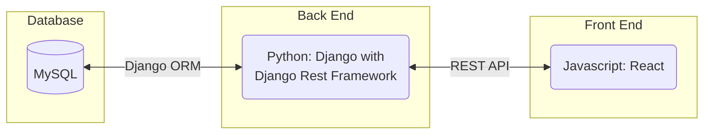
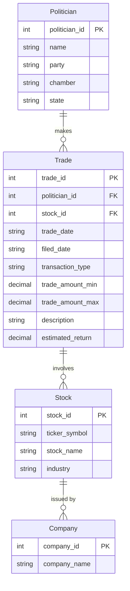
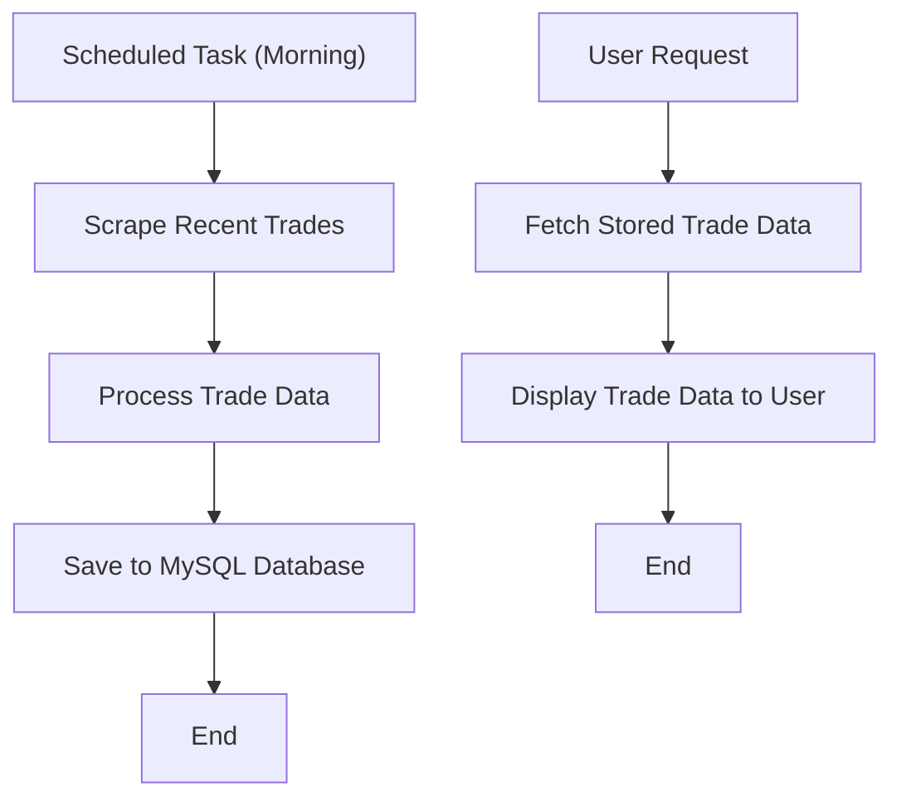
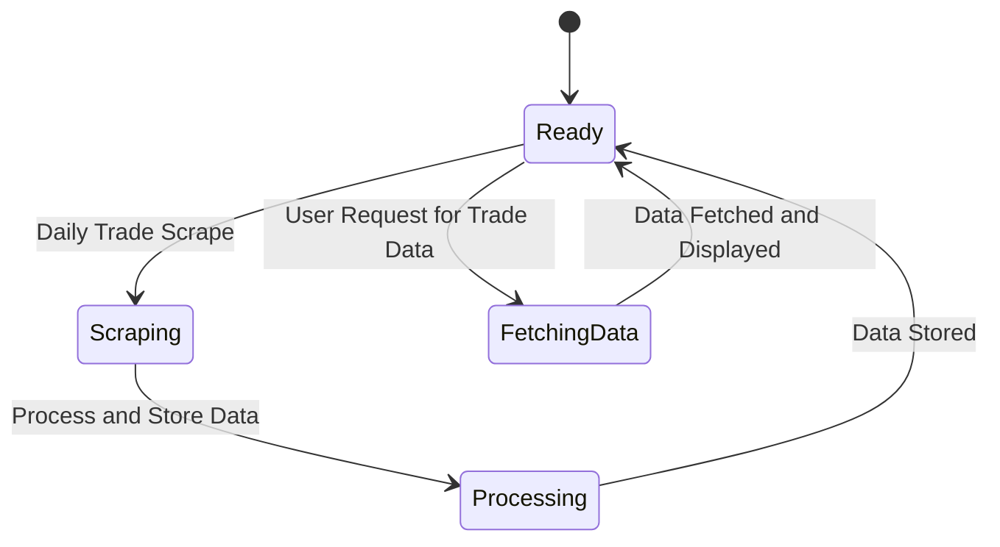
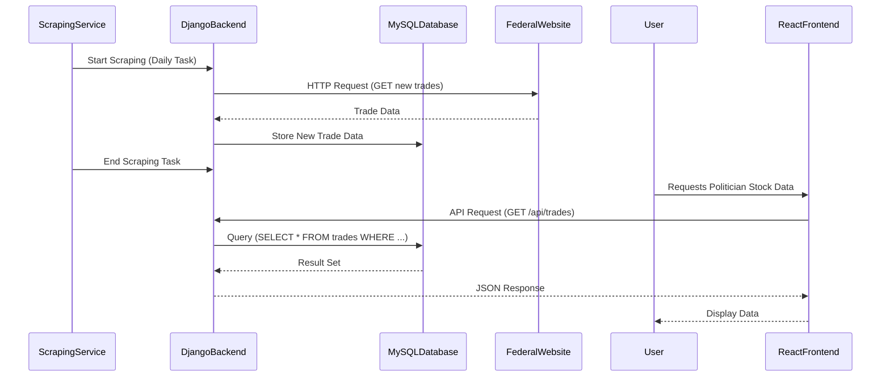

# Capitol Gains - Politician Trade Tracker

## Team Name
Capitol Gains

## Project Abstract
Capitol Gains is developing a platform for tracking American politicians' stock trades, ensuring transparency and enabling the public to make informed decisions. The platform scrapes data from a website that tracks congressional stock trades and parses the information into a structured format. The application updates daily by scraping this data and storing it in a MySQL database. Using Python (Django) for the backend and React for the frontend, users can view, filter, and analyze trading activities of different groups of politicians (e.g., Democratic Senators or Republican Congressmen). The goal is to allow users to track and model their investment strategies based on politician trading activities, adhering to the 2012 STOCK Act.

## Customer
The application is primarily being developed for our professor and TAs. However, in the broader scope, it is designed for the public who want to keep up-to-date with politician stock trades. The platform's goal is to provide transparency, enabling users to rank politicians by their stock market earnings and gain insights from congressional trading patterns.

## Specification

### Technology Stack
The project uses the following technology stack:

### Database Architecture
The database will store information about politicians, the stocks they trade, and their trading details. The table structure includes the following:

- **Politicians**: Information about each politician (name, political party, chamber, etc.)
- **Trades**: Stock trades made by politicians, including stock ticker, trade date, trade type (buy/sell), and value range.
- **Stocks**: Basic stock information (ticker, company name, industry).

### Flowchart
This flowchart outlines the system's data flow, including the daily web scraping process and how user requests are handled.

### Behavior
The system processes user requests and daily scraping as outlined below:

1. **Scraping Mechanism**: A scheduled task runs every morning, scraping new trade data from a website. This data is processed and stored in the MySQL database.
2. **User Interaction**: Users request data through the frontend. The backend queries the database for the requested trade data and sends it back to the frontend for display.

### Sequence Diagram
This diagram demonstrates how data flows when scraping trades and when users request specific data:

## Standards & Conventions
Coding standards for this project will follow Python’s PEP8 guidelines for the backend and Airbnb's style guide for React.

You can refer to the [Style Guide & Conventions](STYLE.md) document for detailed information on code formatting, naming conventions, and other best practices.

## Testing Strategy
We will use **pytest** for testing the backend services and business logic. Unit tests will cover the scraping functions, database interactions, and REST API endpoints. End-to-end testing will validate user flows from frontend to backend.

## Deployment Strategy
The application will be containerized using **Docker** to ensure a consistent environment across development and production stages. Deployment will be done using university provided virtual machines, which will host the Django backend, React frontend, and MySQL database.

## Known Issues & Future Features
Currently, there are no major known issues. Future enhancements may include:
- Advanced filtering options (e.g., by stock sector, trade value).
- User notifications for new trades.
- Ranking politicians by stock market earnings.