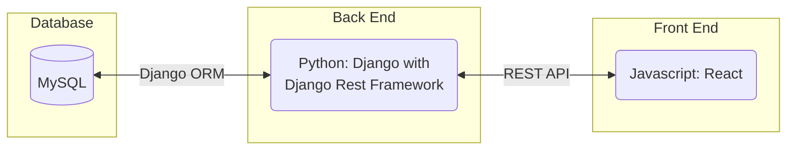
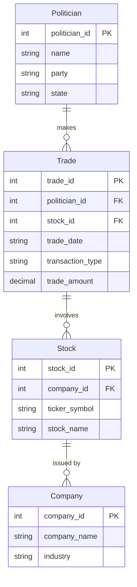
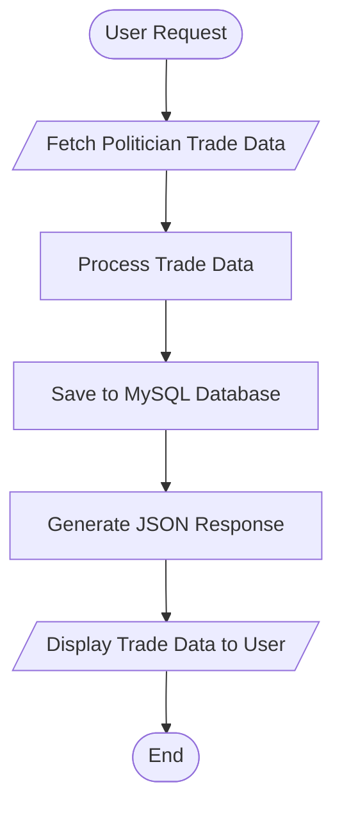
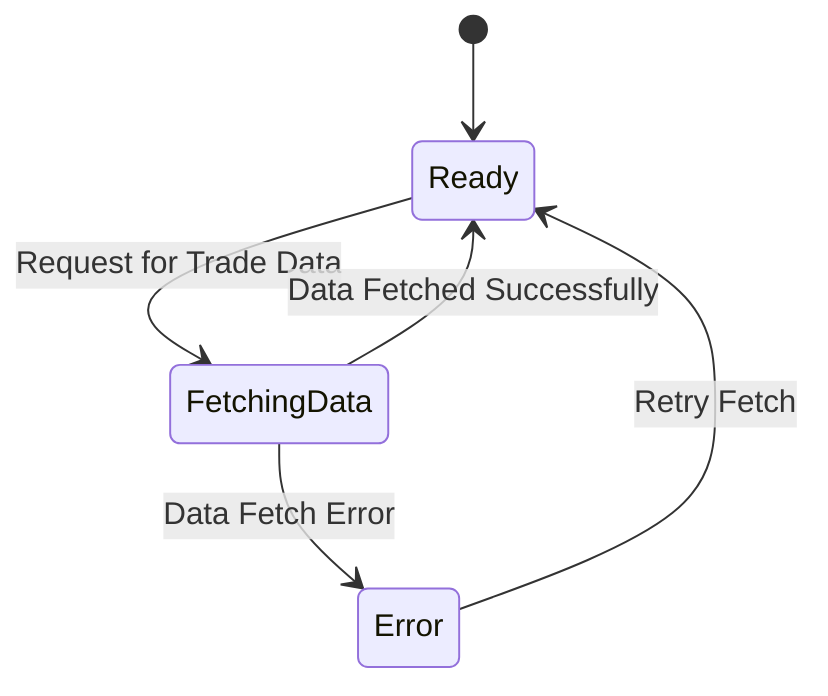
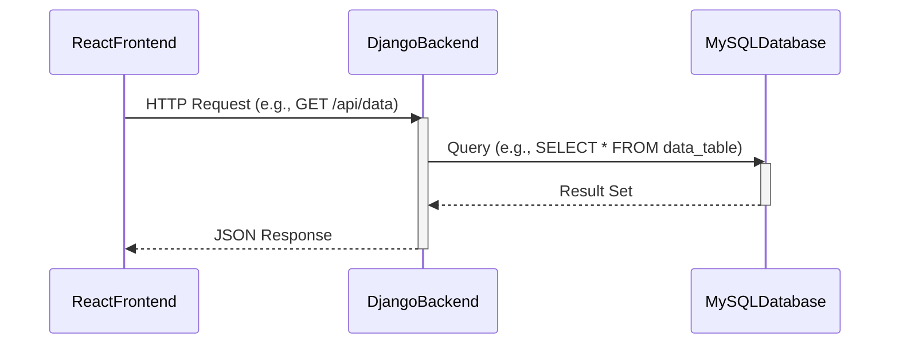

# Capitol Gains - Politician Trade Tracker

## Team Name
Capitol Gains

## Project Abstract
Capitol Gains is developing a platform for tracking American politicians' stock trades, ensuring transparency and enabling the public to make informed decisions. The platform will pull data from the Financial Disclosure website where politicians report their trades. The data will be presented in an easy-to-navigate interface using Python (Django) on the backend with a MySQL database, and React on the frontend. This platform allows users to monitor stock trades, compare trading activity, and model their own investment decisions based on the activity of their favorite politicians, aiming to mirror the functionality of Capitol Trades.

## Customer
Capitol Gains is primarily being developed for our professor and TAs to meet the project requirements. In the broader scope, the platform is designed for the public who want to keep up-to-date on politician stock trades. The goal is to provide transparency in political stock transactions and help users model their own trades based on these reports, fostering accountability and fair access to financial information.

## Specification

### Technology Stack
The project uses the following technology stack:

### Database Architecture
Our database will store information about politicians, the stocks they trade, and the companies associated with those stocks. Below is an initial draft of the ER diagram:

Further details on database relationships and schema will be provided as development progresses.

### Flowchart
This flowchart describes how the system processes user interactions and data flows from the frontend to the backend and database:

## Behavior
The behavior of the system is modeled using the following state diagram, which will evolve as the project develops:

## Sequence Diagram
The interaction between the frontend, backend, and database is captured in this sequence diagram. This diagram shows how user requests will be processed:

## Standards & Conventions
Our coding standards and conventions follow established guidelines to maintain consistency and code quality across the project.

You can refer to the [Style Guide & Conventions](STYLE.md) document for detailed information on code formatting, naming conventions, and other best practices.

## Testing Strategy
We will use **JUnit 5** for our testing framework to ensure the backend's reliability and functionality. Unit tests and integration tests will be written to cover key functions of the system.

## Deployment Strategy
We will use **Docker** for containerizing the application, ensuring consistent environments across development and production. Additionally, we plan to deploy using cloud services (AWS or Azure, yet to be determined) for hosting our application and managing the MySQL database.

## Known Issues & Future Features
Currently, there are no major known issues. Future features might include advanced filtering options, user notifications for new trades, and the ability to track specific politicians or stocks.